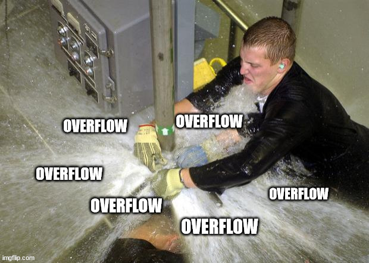

# Frontend Mentor - Huddle landing page with single introductory section solution

This is a solution to the [Huddle landing page with single introductory section challenge on Frontend Mentor](https://www.frontendmentor.io/challenges/huddle-landing-page-with-a-single-introductory-section-B_2Wvxgi0) 

### The challenge

Users should be able to:

- View the optimal layout for the page depending on their device's screen size
- See hover states for all interactive elements on the page

### Screenshot

### Links

- [Solution](https://www.frontendmentor.io/solutions/huddle-landing-page-with-html-css-m7WsmTqZy9)
- [Live Site](https://lspacka.github.io/FEM-huddle-landing-page/)

### Built with

- HTML
- CSS

### What I learned

This is an accurate depiction of my CSS process:

## Author

- [Frontend Mentor](https://www.frontendmentor.io/profile/lspacka)
- [Twitter](https://www.twitter.com/lspacka)

Social media icons by [Stockio](https://www.flaticon.com/authors/stockio)